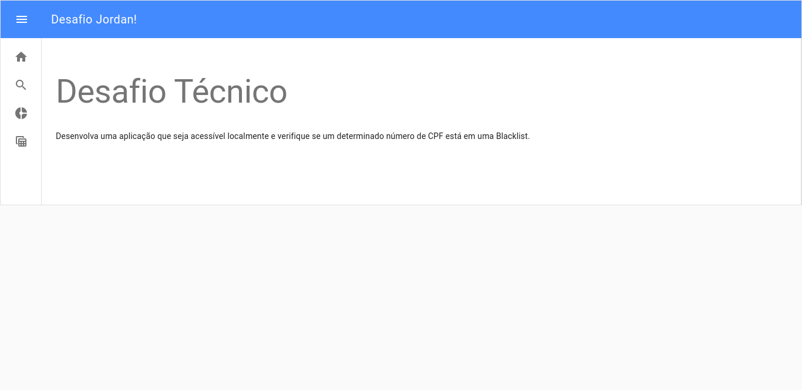
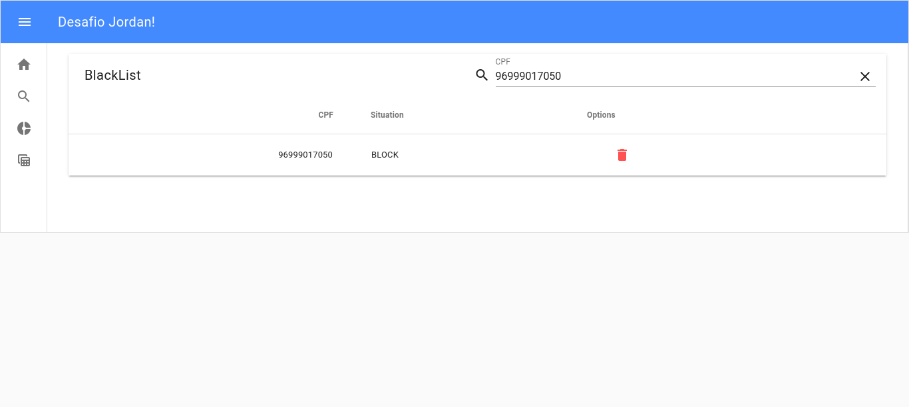
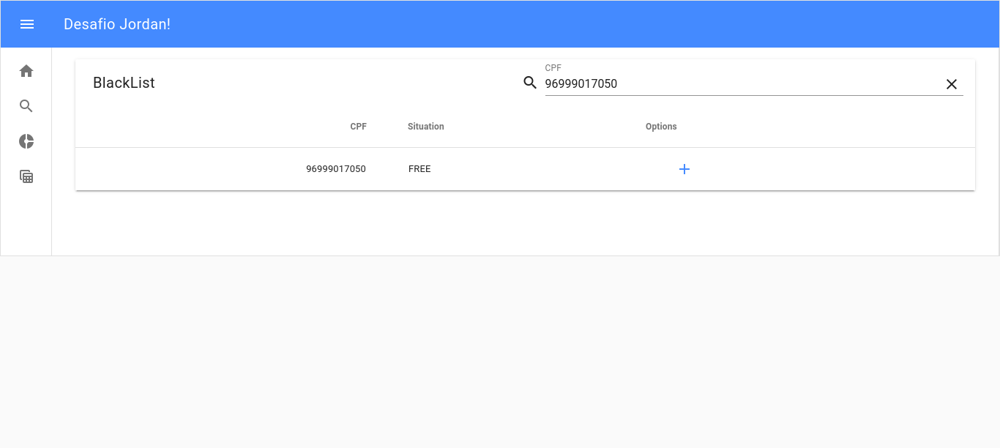
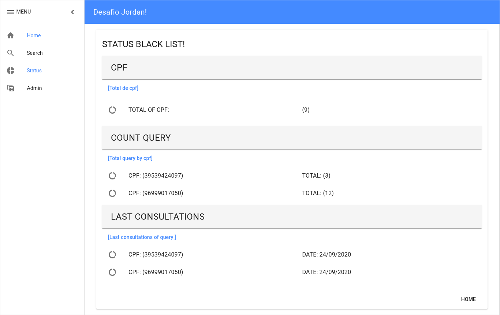
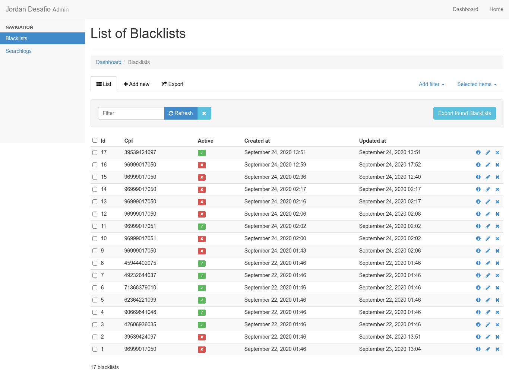

# README

# Screem

# Things you may want to cover:

* Ruby version `2.5.5`

* Rails version `Rails 5.2.4.3`

* System dependencies  `Gemfile and packages.json`

* Database  `PostgreSQL`

* Database initialization `rails db:create`

* Deployment instructions
    * bundle install
    
    * rails db:create

    * rails db:migrate

    * rails db:seed

    * yarn install

    * rails s 

    * Docker 

# Mini tutorial 
    $ bundle install
    $ rails new jordan_desafio --webpack=vue
    $ rails generate controller Home index
    $ gem 'pg', '>= 0.18', '< 2.0' 
    $ RAILS_ENV=development rake db:create or rails db:create
    $ rails g model Blacklist cpf:string active:boolean
    $ rails g model Searchlog cpf:string situation:string blacklist:references
    $ rails db:migrate
    $ rails db:seed
    * rails g controller api/v1/searchs
    

# Routes
  
  root 'Home#index'

  url `http://localhost:3000/#/`

# Front

    $  yarn add axios vue-axios

    $  yarn add vue-router

    $  yarn add vue-material
    
    $  yarn add moment

# Backend
  
  * backend:  $ bin/rails s -p 3000  `or` rails s 
  
  * frontend: $ bin/webpack-dev-server `or` rails webpack-dev-server
  
  * `or`
  
  * rails s

# Docker 

    $ cd ./docker/

    $ docker-compose up -d

# var in rails 

Name Begins With  |    $              |           @           |    [a-z] or _     | [A-Z]      | @@             | 
----------------- | ----------------- | --------------------- | ----------------- |----------- |--------------- |
Variable Scope    | A global variable | An instance variable  | A local variable  | A constant | A class variable

# git
  - $ git init
  - $ git config --global user.name "nome"
  - $ git config --global user.email blabla@gmail.com
  - $ ls .git
  - $ git remote add origin git@github.com:codpuer/tutorial-github.git

# Author

